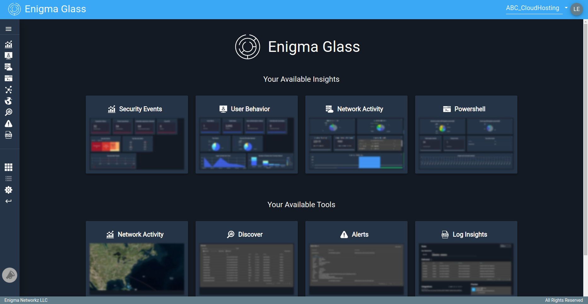

# Enigma Glass Platform Documentation
{: .important-title .no_toc}

> ## Disclaimer
> 
> Some aspects or tools within Enigma Glass did not appear within this documentation as they are still under active development.
{: .important .highlight}

This section will drill down into every aspect of Enigma Glass in hopes of providing an easy-to-use resource that can be used to understand the workings of this platform. This resource will be laid out in the order that sections show up on the platform, starting with security events and ending with log insight. The objectives of this section are:

- To provide the user with the basic information they need in order to navigate Enigma Glass
- To provide an organized document that can be used as a reference at any time

