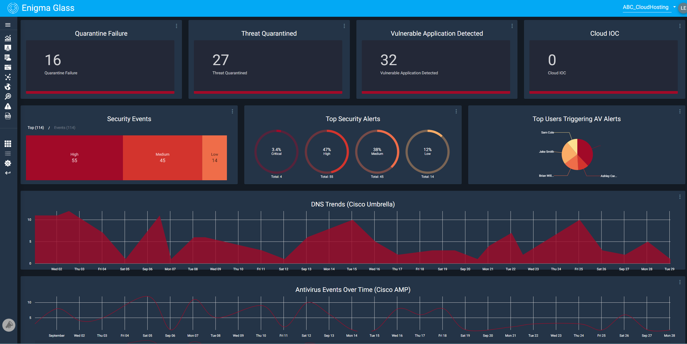
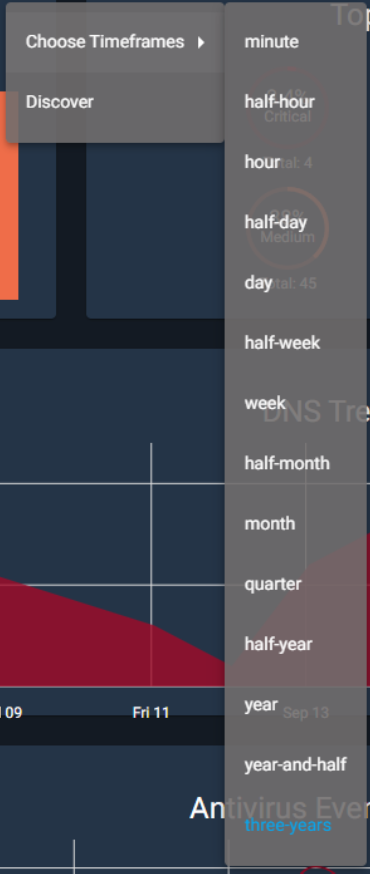
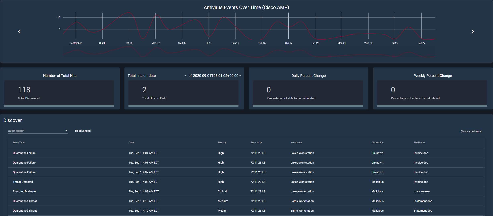
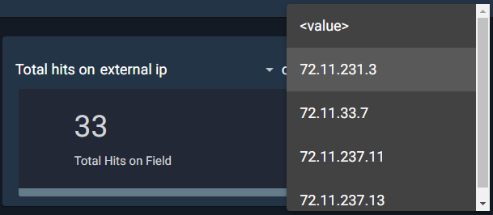

# Enigma Glass Documentation

## Learning Objectives:

- To provide the user with the basic information they need in order to navigate Enigma Glass
- To provide an organized document that can be used as a reference at any time

## Overview:

This is a basic document that will drill down into every aspect of Enigma Glass in hopes of providing an easy-to-use resource that can be used to understand the workings of this platform. This resource will be laid out in the order that sections show up on the platform, starting with security events and ending with log insight.  

---

  

    Table of contents
  

  {: .text-delta }
1. TOC
{:toc}

---

# Getting Started

## Security Events

Under the home screen of the Security Events tab, one can find multiple widgets available to assist users in monitoring security events on the network. The widgets consist of: Quarantine Failure, Threat Quarantined, Vulnerable Application Detected, Cloud IOC, Security Events, Top Security Alerts, Top Users Triggering AV Alerts, DNS Trends (Cisco Umbrella), and Antivirus Events Over Time (Cisco AMP). The home screen offers a quick visual for administrators to monitor events quickly through the efficient use of graphs to break down specifics such as Top Security Alerts.

There are currently 9 different widgets available when you open security events from the dashboard. Each one works similarly to the other; in that, you have the option to “Choose Timeframes” and “Discover.”

The choose timeframes option allows you to choose between 14 different intervals. These intervals will determine the timeframe of the data that the infographic will show. For example, if you have it set to a half-hour, the infographic will only show data that was gathered in the last half-hour. It is also worth noting that the currently selected option is highlighted in blue. 

The Discover option is a bit more complex. Choosing this option will take you to a new page with more information about the widget as shown below. This page will show you the corresponding infographic as well as the total number of hits for that category. In this example, there were 55 total discovered security events. 

---

### Quarantine Failure

This widget is responsible for centralizing all known data related to quarantine failures occurring on workstations across the network. Quarantining is when a file that was supposed to be temporarily neutralized to protect the system. When this quarantine fails, it can potentially put the system at risk.

---

### Threat Quarantined

This section deals with files that have been successfully quarantined. This section can be used to deal with the threats within these files and potentially release them from quarantine.

---

### Vulnerable Application Detected

This section tracks applications and categorizes them if they are deemed vulnerable. Vulnerable applications are any programs that contain backdoors or other exploitable loopholes that could be used to access or disrupt the system.

---

### The Security Events

The security events tab contains a lot of important information. A security event can be described as unusual activity that could potentially cause harm or unintended access to a system. This page aggregates the data from these activities and categorizes them by how much of a threat they are (high, medium, or low). 

---

### Top Security Alerts

Similar to the Security Events widget, the Top Security Alerts widget categorizes the events by severity: Low, Medium, High, and Critical. 

---

### Top Users Triggering AV Alerts

This widget is used for tracking which user account or system is responsible for triggering the antivirus alerts. The information from this section can be used to decide whether or not employees need more training, or even if there is a risk of an insider threat.

---

### Antivirus Events Over Time (Cisco AMP)

This is a fairly simple section. It aggregates the information from every type of antivirus event. This includes events listed above such as a quarantine failure, threat detected, malware executed, etc.

---

## Using the Discover Tool

Each of the widgets are laid out in a similar way in order to ensure ease of use for the user. Each widget will have a corresponding graph or visual tool at the top of the page. Underneath that, they share 4 tiles that include "Number of Total Hits", "Total hits on...", "Daily Percent Change", and "Weekly Percent Change".

The "Total hits on..." tile allows for customization by the user. The user can sort through information using one of eleven different filters, such as data, event type, hostname, etc. So, if the user were to select external IP, the next dropdown would include all available IP addresses to choose from. Then it will calculate the number of hits from that IP address. 

The next two tiles both deal with calculating both the daily and weekly percentage change for the total number of hits.

---

At the bottom of the page, the user will find the actual discover panel. Here it shows in-depth information about each security event that has occurred. You can either page through this data with the arrows at the bottom or change the total number of items per page, next to the arrows.

The user can do a quick search from the search bar in the top right. This is just a simple search field that allows users to quickly find something specific they are looking for. For example, if a user is looking for an IP that contains 237, they can type that into the search bar and filter through.

There is, however, an advanced search option as well. The main benefit of this option is that you can search multiple strings at once. For example, if you are looking for a specific IP address that has high severity, you can type both of those in and they will search as different strings. 

Enigma Glass also gives you the option to select which columns to view at once, through a dropdown with checkboxes. It also allows you to export data to 5 different data types including CSV, JSON, and XLS.

---

## Network Activity

The network activity tab is a visualization tool present within Enigma Glass. Multicolored lines will appear on the world map indicating where an attack originated and the target of the attack. 

Highlighting one of these lines will pull up an informational box. This box includes information such as the country of origin, the target country, the type of attack, the port attacked, and the time of the attack.

In the top left, there are map controls such as fullscreen and zooming in and out. The user can also zoom in and out via the scroll wheel and pan around the map by holding down the left mouse button.

---

## Alerts

On this page, there are four different rules that have been set up. If one of these rules is met, then the user will be alerted and an event will be added underneath the corresponding rule. If an event is categorized as either high or critical severity, it will automatically alert the user. In addition, if a medium severity alert occurs 3 times in 1 minute, an alert will also go off. 

Clicking on any of the Alerts/Rule Names will expand the table. In the newly revealed table, there is a plethora of additional information that the user can use to investigate the event. There is also a ribbon containing each event that has triggered the alert.

---

## Log Insight

---

## Disclaimer

Some aspects or tools within Enigma Glass did not appear within this documentation. This is due to no data existing within those tools. This documentation excludes those sections because they will not be used in training materials, labs, or case studies.

[Back to Top](#Enigma-Glass-Documentation)