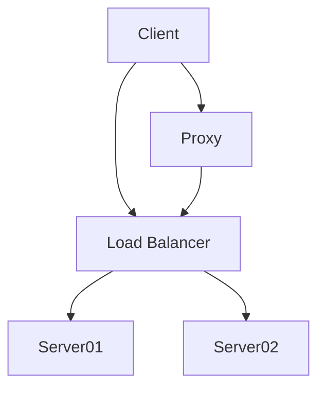

# Enigma Glass Training Materials
{: .important-title .no_toc .fs-9}

Welcome to the Enigma Glass training resource. Here you'll find:
 - System documentation for the Enigma Glass platform
 - Training materials intended to provide the context required to understand the benefits of the Enigma Glass platform, including follow-along friendly case studies to explore what you can do with Enigma Glass in its current state

 {: .important }
> {: .opaque }
> 

> {: .warning }
> A paragraph
> 

This is the development version of the Enigma Glass documentation. [Click here](https://enigmaglass-docs.github.io/enigmaglass/) to go to the most up to date version of this page.
{: .warning}

This is a mermaid diagram

{: .mx-auto}