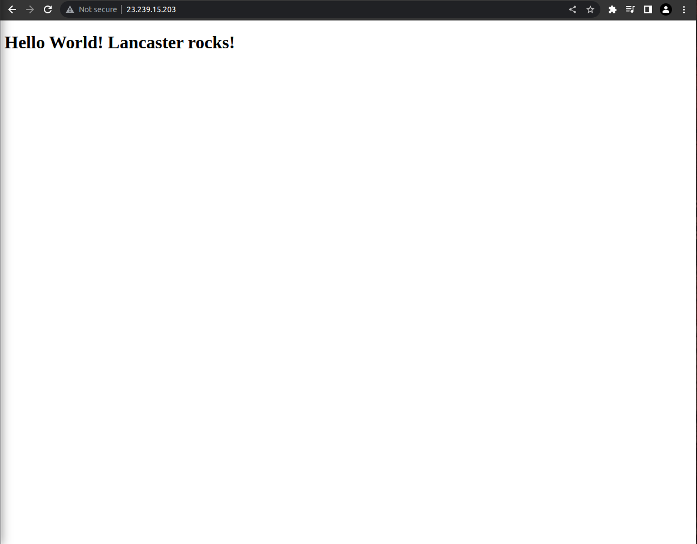

# Analyze Apache Access Logs with Elastic
{: .important-title .no_toc}

<details open markdown="block">
  <summary>
    Table of contents
  </summary>
  {: .text-delta }
1. TOC
{:toc}
</details>

## Overview
The Elastic stack is a collection of open-source tools for managing and analyzing data. It includes Elasticsearch, a search and analytics engine, and Kibana, a tool for visualizing and analyzing data. The Elastic stack is widely used for log analysis; for example, many organizations use it to process and analyze their Apache access logs.

This guide to analyzing Apache access logs with the Elastic stack provides context for understanding the benefits of the Enigma Glass platform, which is a SIEM solution built using the Elastic stack.

SIEM solutions like Enigma Glass ingest all kinds of logs using small “agent” processes that run on devices. These agents can watch log files for changes, filter additions using software defined rules, and intelligently serve relevant data as json to a key-store index running somewhere else. The communication between the agents and the server can be TLS encrypted, which makes it possible to securely ingest logs from edge devices on entirely different networks.

Agents are highly configurable and can be customized to support any application that logs to a file. The connection log of a single apache webserver is enough data to create some really interesting visualizations and see some bad actors in action.

## Environment
<dl>
  <dt>Linode</dt>
  <dd>Virtual Private Compute provider</dd>
  <dt>Ubuntu</dt>
  <dd>Server Operating System</dd>
  <dt>Apache2</dt>
  <dd>Webserver</dd>
  <dt>Logstash</dt>
  <dd>Log ingestion service - Elastic Product</dd>
  <dt>Elasticsearch</dt>
  <dd>Key store database that stores logs and elastic configuration - Elastic Product</dd>
  <dt>Kibana</dt>
  <dd>Frontend for Elasticsearch to visualize data - Elastic Product</dd>
</dl>

## See it in action
### Apache Access Log
Below you can see the contents of the `access.log` file that is stored in logging directory of the Apache server. Every web request that the webserver receives is logged here as text. Each message contains a timestamp that can be used to index the log event.


An Apache access log is a file that records information about client requests made to an Apache web server. The log records a range of information about each request, including the IP address of the client, the time of the request, the request method (e.g. GET or POST), the requested resource, the HTTP response code, and the size of the response.

To read an Apache access log, you will need to open the log file in a text editor or a specialized log analysis tool. The log file is typically organized as a series of lines, with each line representing a single request. Each line contains a number of fields, separated by spaces or other delimiters, that provide information about the request.

For example, a typical Apache access log entry might look like this:

```
10.0.0.1 - - [30/Sep/2018:12:34:56 -0400] "GET /index.html HTTP/1.1" 200 1234
```

In this example, the first field is the IP address of the client that made the request. The second and third fields are not used in this log format, so they are typically left blank. The fourth field shows the time of the request, including the date, time, and time zone. The fifth field shows the request method (GET) and the requested resource (/index.html). The sixth field shows the HTTP response code (200), which indicates that the request was successful. The final field shows the size of the response (1234 bytes).

To make it easier to read and analyze Apache access logs, you can use a log analysis tool that can parse the log entries and display them in a more user-friendly format. These tools often allow you to filter and search the log entries, and to generate reports and charts that provide insights into the server's traffic and performance.

### Logging Agent Configuration
Logstash is a tool for managing and analyzing log data. Logstash uses configuration files to specify the data sources and outputs for log data, as well as any filters or transformations that should be applied to the data.

An Apache.conf file is a Logstash configuration file that is used to process Apache access log data. The configuration file specifies the location of the Apache access log files, the format of the log entries, and any filters or transformations that should be applied to the data.

Here is an example of a simple Apache.conf file that can be used to process Apache access log data:

```
input {
  file {
    path => "/var/log/apache/access.log"
    type => "apache"
  }
}

filter {
  grok {
    match => { "message" => "%{COMBINEDAPACHELOG}" }
  }
}

output {
  stdout { codec => rubydebug }
  elasticsearch {
    hosts => ["localhost:9200"]
  }
}

```
In this example, the input section specifies that the Apache access log files are located in the /var/log/apache directory, and that the log entries have the "apache" type. The filter section uses the grok filter to parse the log entries and extract the individual fields. The output section specifies that the processed log data should be written to the standard output (stdout) and to an Elasticsearch instance running on localhost.

This is just a basic example of a Logstash configuration file for Apache access logs. In a real-world scenario, you might want to customize the configuration further to add additional filters or transformations, or to output the log data to other destinations.

Below is the contents of `/etc/logstash/conf.d/apache.conf` on our server, which stores the filtering rules that inform the pipeline on how to format the data in the json it's sending to the Elastic server, and where to look for the logs. Note that we're mapping the `clientip` field to the type `geoip` . This tells the Elastic server to take the ip address data from the log event and populate additional geo fields to add to the event json that can give us coordinates for the ip. You can read more about GeoIP in the Elastic Stack [here](https://www.elastic.co/blog/geoip-in-the-elastic-stack).


### Generating Logs
Now that Elastic is configured to ingest logs from our webserver we can generate a few logs by visiting the site in a browser. Here is what our simple website looks like:



As you can see, our site is very basic. Our connection to the site is not encrypted with TLS. The only security measures that've been taken on the webserver are the configuration of a firewall and access hardening (only accept ssh keys and only allow ssh connections from my home network's external IP address).

### Apache Log Event
Kibana is a tool for visualizing and analyzing data. It is often used in combination with Elasticsearch, a search and analytics engine, to provide a graphical user interface for working with log data.

In Kibana, an Apache log event is a record of a request made to an Apache web server. The log event contains a range of information about the request, such as the IP address of the client, the time of the request, the request method, the requested resource, the HTTP response code, and the size of the response.

Apache log events are typically displayed in a table or list format in Kibana. Each log event is represented by a single row in the table, with the different fields of the event displayed in separate columns.

For example, an Apache log event in Kibana on our server looks like this:


### Events in Aggregate
The Discover page in Kibana is a tool for searching and analyzing log data. It allows users to view, filter, and query log events in real-time, as well as to generate charts and other visualizations to gain insights into the data.

To analyze log events on the Discover page of Kibana, users can start by selecting the data source for the log events. This might be a specific index in Elasticsearch, a saved search, or another data source. Once the data source has been selected, users can use the search bar at the top of the page to enter search queries to filter the log events.

For example, a user might enter a query like this to filter the log events by response code:

```
response_code:200
```

This query would return only log events that have a response code of 200, which indicates that the request was successful. Users can also use wildcards, regular expressions, and other query operators to create more complex search queries.

Once the log events have been filtered, users can view the results on the Discover page. The log events are displayed in a table or list format, with each event represented by a single row. Users can click on individual log events to view more detailed information about them, or they can use the fields on the left side of the page to select which fields should be displayed in the table.

In addition to viewing the log events, users can also use the Discover page to generate charts and other visualizations. For example, users can use the histogram visualization to view the distribution of log events over time, or they can use a pie chart to view the breakdown of log events by response code. These visualizations can help users identify trends and patterns in the data and gain insights into the server's traffic and performance.

Here is what the discover page looks like on our server:


You might think that the only log events we should see here are the ones that were generated when we visited the site in the browser, but here we can see that there are already more requests from other external ip addresses. Who are these people?

### Visualising Data
Data can be visualised in charts or graphs for aggregate analysis. Users can apply filters to the visualisations that change the scope of time and any other field in the event json.

HTTP response status codes are returned by the webserver to the client to indicate whether the request has been completed sucessfully. The 5 major classes of status codes are:

| Status Code | Class |
|:-|:-|
| `100` - `199` | Informational responses |
| `200` - `299` | Sucessful responses |
| `300` - `399` | Redirection messages |
| `400` - `499` | Client error responses |
| `500` - `599` | Server error responses |

Here you can see a pie chart displaying the different status codes that have been received by the server in the last 7 days. The webserver has been running for ~4 days at this point.


It looks like status the code that is returned the most is `200`, followed by `404`. Here's what these codes mean:

| Status Code | Meaning |
|:-|:-|
| `200` | OK - The meaning of this code depends on the HTTP method, but this generally means that the request was sucessful. |
| `400` | Bad Request - The server is either incapable or unwilling to process the request due to a client error, like malformed syntax or deceptive request routing. |
| `404` | Not Found - The server cannot find the requested resource; the page does not exist |
| `408` | Request Timeout - The server would like to close an idle connection. |

27.52% of the requests that our webserver has receive up until this point have returned `404`, or "Not Found". Whoever is making these requests seems to be trying to access a page that does not exist on the server.

Data visualizations can be a valuable tool when seeking to answer quick questions like "What are the most common HTTP methods that are used in our web requests?"


The HTTP method that is used to make the request determines the action to be preformed on the resource that is identified by the path in the request url.

| HTTP Method  | Meaning |
|:-|:-|
| `GET` | Used to retrieve data from a specified resource in the webserver. This is the request that's used when you visit a page in your browser. |
| `POST` | Used to send data to the webserver to create or update a resource. |
| `CONNECT` | Used to establish a tunnel to the server indentified by the URL. |
| `PRI` | Used when the server receives a request that it is not set up to handle. |
| `HEAD` | Used to retrieve the metadata that is associated with a URL without the message body in the response, which would contain the page content in a `GET` request. |
| `OPTIONS` | Used to retreive the the permitted communication options for a URL or server.  |

We can use a treemap visualisation to take a look at the most common resources that are requested (using the path in the URL) for each response code that is returned for all `POST` requests the the webserver has recieved:


This visualisation was created by selecting the `response.keyword` and `request.keyword` fields to group by and filtering the log events to be passed to the visualisation to `POST` requests.

We can see that the most frequently requested resource to `POST` to on our webserver has a path of `/boaform/admin/formLogin`. A quick Google search of this path yields [this article](https://www.theregister.com/2020/04/16/fiber_routers_under_fire/) that suggests that what we might be seeing here is a botnet searching for vulnerable fiber optic routers.

We can take a closer look at these requests in the Discover section with some filters:


How do these servers know that our server is running a webserver? Most likely, they don't. Malicious actors iterate through external ip addresses with requests based on known existing security vulnerabilities. Most of the time they will not receive a successful response, but botnets can contain hundreds of thousands of infected nodes. Even a very low success rate can be very profitable depending on the vulnerability.

A botnet is a network of compromised computers that are controlled by a single attacker. The attacker can use the botnet to carry out various malicious activities, such as distributing spam or launching distributed denial of service (DDoS) attacks.

Security infrastructure and event management software can detect and mitigate botnet threats in several ways. For example, the software can monitor network traffic for signs of botnet activity, such as large numbers of requests coming from a single IP address or unusual patterns of traffic. The software can also monitor for known indicators of botnet activity, such as specific commands or communication protocols that are used by botnets.

Once a botnet has been detected, security infrastructure and event management software can take steps to mitigate the threat. This might involve blocking the botnet's communication channels, isolating infected computers from the network, or taking other steps to prevent the botnet from carrying out further malicious activities.

In addition to detecting and mitigating botnet threats, security infrastructure and event management software can also help organizations prevent botnet infections in the first place. This might involve implementing security measures such as firewalls, intrusion prevention systems, and network segmentation to make it more difficult for botnets to gain access to an organization's systems. Regular security updates and patches can also help prevent botnet infections by closing known vulnerabilities in an organization's systems.

### Dashboards
Dashboards are a key feature of many security infrastructure and event management software systems. A dashboard is a graphical user interface (GUI) that provides a real-time, high-level overview of an organization's security posture.

The function of dashboards in security infrastructure and event management software is to provide security personnel with a quick and easy way to monitor the state of an organization's security systems. This can help security personnel identify potential threats and respond to them in a timely manner.

Typically, dashboards in security infrastructure and event management software display a range of information about an organization's security systems, such as the number of security alerts that have been generated, the number of security incidents that have occurred, and the status of various security tools and systems. The dashboard might also display information about the current state of the network, such as the number of active connections and the amount of traffic flowing through the network.

In some cases, dashboards in security infrastructure and event management software might also provide tools for security personnel to take action to respond to potential threats. For example, the dashboard might allow security personnel to view detailed logs or reports, run security scans, or deploy security tools to prevent or mitigate potential threats.

Data visualistaions can be collected in dashboards to allow users to see visualisations that can be made up of data from a variety of sources. Below is a screenshot of an example overview dashboard that a webmaster might user to monitor the perfomance of their apache server.


This dashboard contains a few interesting visualisations using geo data from the log events.


### Drilling Down
"Drilling down" is a term used in the context of security infrastructure and event management software to describe the process of investigating a particular security event or incident in more detail.

When security personnel are monitoring an organization's security systems, they may come across a security event or incident that warrants further investigation. For example, they might see an alert indicating that a particular IP address is sending a large number of suspicious requests to a web server. In this case, they can "drill down" into the event or incident by looking at more detailed information about the event, such as the specific requests that were made, the source and destination of the requests, and any other relevant details.

To "drill down" into a security event or incident, security personnel can use the tools and features provided by the security infrastructure and event management software. This might involve using the dashboard to view more detailed information about the event, using search and filter tools to find relevant log entries, or using other tools to collect and analyze data about the event.

The goal of "drilling down" into a security event or incident is to gather as much information as possible about the event and its potential impact. This can help security personnel understand the nature and severity of the event, and can provide them with the information they need to take appropriate action to prevent or mitigate the event. Ultimately, "drilling down" into security events and incidents can help organizations improve their security posture and better protect themselves against potential threats.

In this screenshot example, the user has "drilled down" on the client country visualisation by selecting the United States. This dashboard was created to display various geo data, but by drlling down through the webmaster dashboard a filter has been applied that only populates the visualisations with events from the United States.


This dashboard has been created to display information regarding post requests made to the server.


By selecting the part of the treemap that represents the 50% of requests that are targeting that boaform path, we can drill down into the geo data dashboard that we saw before with some filters applied to only show us log events that are associated with that path. 


## Conclusion
This training document has explained to use the Elastic stack to process, search, and visualize Apache access logs. It has also provided examples of how to use the various tools in the stack to gain insights into the server's traffic and performance.

By reading the guide, users can learn how the Elastic stack can be used to analyze Apache access logs and gain insights into their data. This can provide context for understanding the capabilities of the Enigma Glass platform, which is built using the Elastic stack and provides similar features and functionality for analyzing log data.

## Read more
- [Visualize Apache Logs With Elastic Stack on Ubuntu 18.04 - Linode Guide](https://www.linode.com/docs/guides/visualize-apache-web-server-logs-using-elastic-stack-on-ubuntu-18-04/)