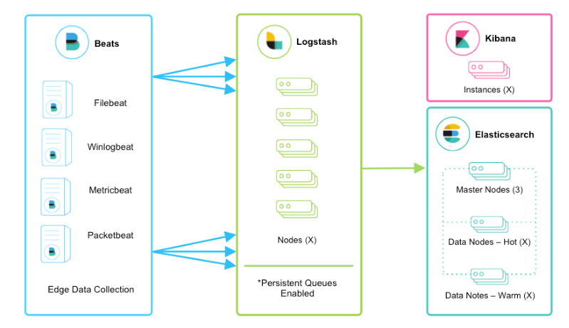

# The Elastic Stack
{: .important-title .no_toc}

  

    Table of contents
  

  {: .text-delta }
1. TOC
{:toc}

## Overview
The Elastic Stack, formerly known as the ELK Stack, is a collection of open-source tools that are typically used together to help analyze and visualize data. The components of the Elastic Stack include Elasticsearch, Logstash, and Kibana.

Enigma Glass has been built using this software stack.

The Elastic Stack consists of four major components:

## Elasticsearch
Elasticsearch is a search and analytics engine that is used to store, search, and analyze large volumes of data quickly and in near real time. It is a distributed, RESTful search and analytics engine that is built on top of Apache Lucene.

## Logstash
Logstash is a data processing pipeline that ingests data from a variety of sources, transforms it, and then sends it to a store like Elasticsearch. It is often used to collect, parse, and transform logs, but it can be used to process other types of data as well.

### Beats
Beats are small agent processes that can run on edge devices that collects logs and sends them to Logstash.

## Kibana
Kibana is a visualization tool that is used to analyze and explore data stored in Elasticsearch. It provides a user-friendly interface that allows users to create and save custom dashboards that display data in a variety of formats, such as tables, maps, and graphs. It can also export visualizations as components that can be embedded in any webpage.

## Elastic as a SIEM tool
In the context of security infrastructure and event management, these components of the Elastic Stack can be used together to collect, store, and analyze log data from various sources, such as servers, security devices, and applications. This can help security teams to detect and investigate potential security threats, as well as to monitor the overall health and security of their systems. Additionally, the visualization capabilities of Kibana can be used to create dashboards that provide a real-time view of security-related data, helping security teams to quickly identify and respond to potential security incidents.

## Using Elasticsearch & Kibana for Security Analytics to Fight the Dark Army on Mr. Robot
_~5 min_
<iframe width="587" height="440" src="https://www.youtube.com/embed/3sWxfLNV_wE" title="Using Elasticsearch & Kibana for Security Analytics to Fight the Dark Army on Mr. Robot" frameborder="0" allow="accelerometer; autoplay; clipboard-write; encrypted-media; gyroscope; picture-in-picture" allowfullscreen></iframe>