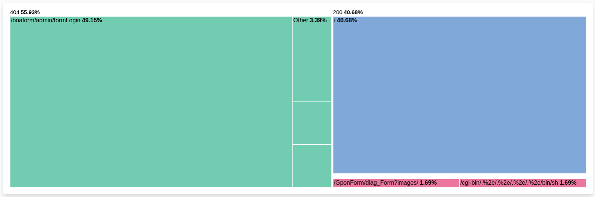
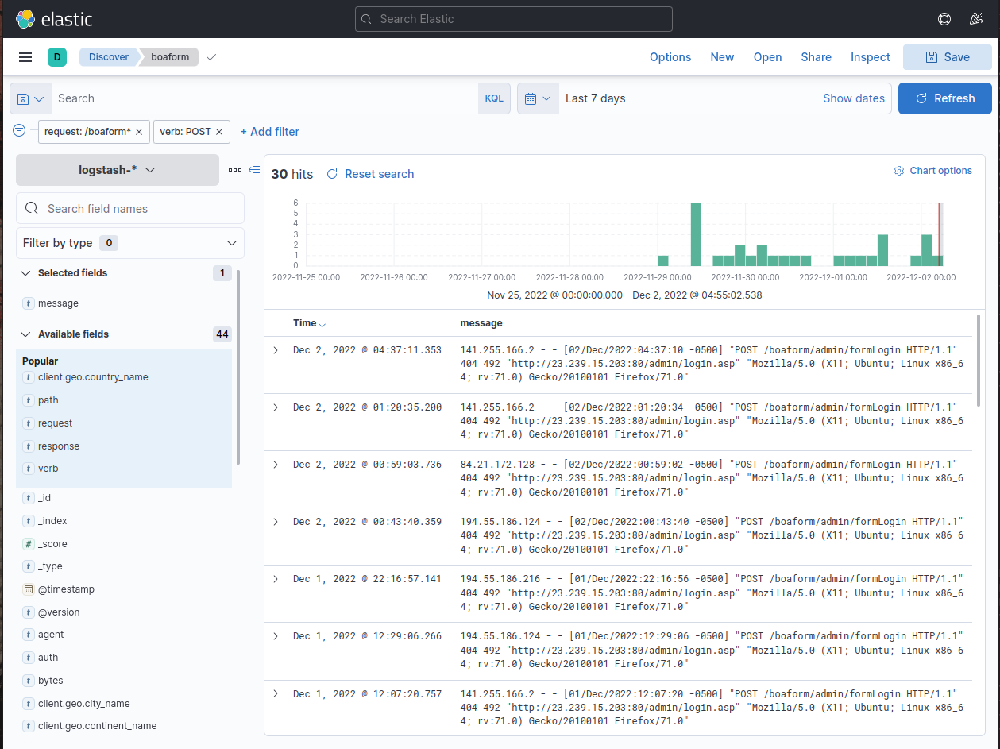
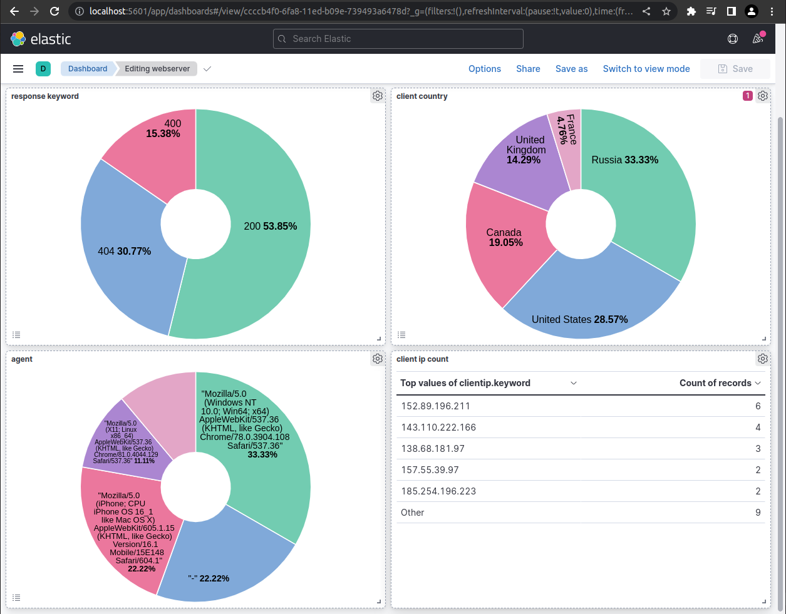
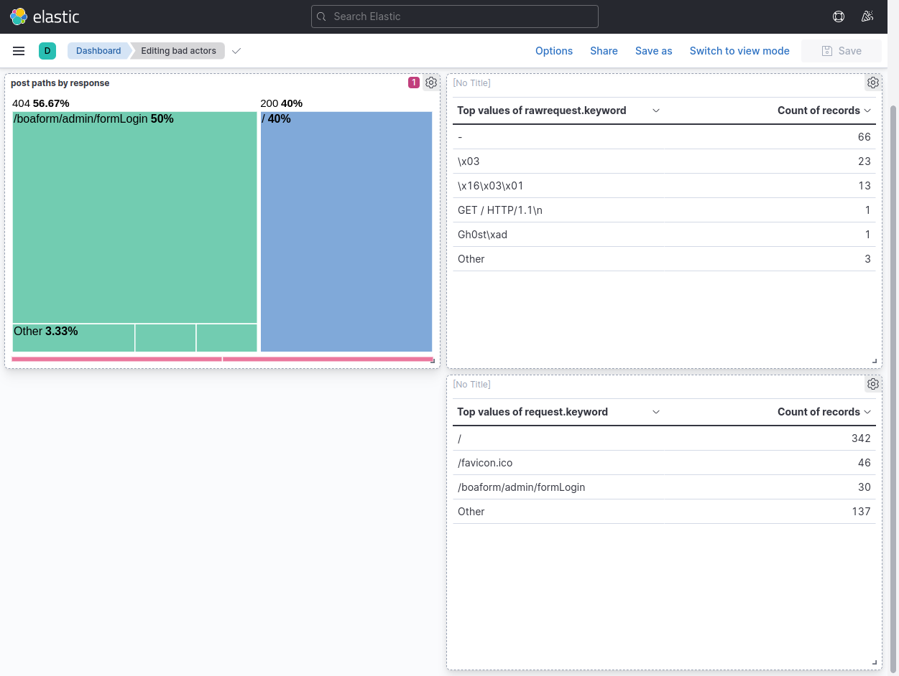

# Monitoring Apache Logs with Elastic
{: .important-title .no_toc}

  

    Table of contents
  

  {: .text-delta }
1. TOC
{:toc}

## Overview
SIEM solutions like Enigma Glass ingest all kinds of logs using small “agent” processes that run on devices. These agents can watch log files for changes, filter additions using software defined rules, and intelligently serve relevant data as json to a key-store index running somewhere else. The communication between the agents and the server can be TLS encrypted, which makes it possible to securely ingest logs from edge devices on entirely different networks.

Agents are highly configurable and can be customized to support any application that logs to a file. For example, a web server running apache could be configured with an agent that watched the connection log. This connection log alone is enough data to create some really interesting visualizations and see some bad actors in action.

The following training document outlines the key steps involved in analyzing logs that are generated by an Apache webserver in Elastic.

## Environment
<dl>
  <dt>Linode</dt>
  <dd>Virtual Private Compute provider</dd>
  <dt>Ubuntu</dt>
  <dd>Server Operating System</dd>
  <dt>Apache2</dt>
  <dd>Webserver</dd>
  <dt>Logstash</dt>
  <dd>Log ingestion service - Elastic Product</dd>
  <dt>Elasticsearch</dt>
  <dd>Key store database that stores logs and elastic configuration - Elastic Product</dd>
  <dt>Kibana</dt>
  <dd>Frontend for Elasticsearch to visualize data - Elastic Product</dd>
</dl>

## See it in action
### Apache Access Log
Below you can see the contents of the `access.log` file that is stored in logging directory of the Apache server. Every web request that the webserver receives is logged here as text. Each message contains a timestamp that can be used to index the log event.

### Logging Agent Configuration
Logstash is Elastic's data processing pipeline. It is one of many solutions for loading data into the Elastic server. Below is the contents of `/etc/logstash/conf.d/apache.conf` which stores the filtering rules that inform the pipeline on how to format the data in the json it's sending to the Elastic server, and where to look for the logs. Note that we're mapping the `clientip` field to the type `geoip` . This tells the Elastic server to take the ip address data from the log event and populate additional geo fields to add to the event json that can give us coordinates for the ip. You can read more about GeoIP in the Elastic Stack [here](https://www.elastic.co/blog/geoip-in-the-elastic-stack).

### Generating Logs
Now that Elastic is configured to ingest logs from our webserver we can generate a few logs by visiting the site in a browser. Here is what our simple website looks like:

As you can see, our site is very basic. Our connection to the site is not encrypted with TLS. The only security measures that've been taken on the webserver are the configuration of a firewall and access hardening (only accept ssh keys and only allow ssh connections from my home network's external IP address).

### Apache Log Event
This is a screenshot of a single apache log event in Kibana, which is Elastic's visualisation layer. This table lists all the fields contained in the event json, which contains fields that are either populated by data that comes directly from the log file, or by data that is the product of a defined data processing pipeline. This makes it possible add an intermediary processing step that can use data from the log event to generate more related data to attatch to the event.

### Events in Aggregate
Below is a screenshot of Kibana's Discover page with the apache logstash index pattern selected. From this view the user can search through the events using Elastic's powerful querying language, or simply by clicking through events and adding filters through the user interface.

You might think that the only log events we should see here are the ones that were generated when we visited the site in the browser, but here we can see that there are already more requests from other external ip addresses. Who are these people?

### Visualising Data
Data can be visualised in charts or graphs for aggregate analysis. Users can apply filters to the visualisations that change the scope of time and any other field in the event json.

HTTP response status codes are returned by the webserver to the client to indicate whether the request has been completed sucessfully. The 5 major classes of status codes are:

| Status Code | Class |
|:-|:-|
| `100` - `199` | Informational responses |
| `200` - `299` | Sucessful responses |
| `300` - `399` | Redirection messages |
| `400` - `499` | Client error responses |
| `500` - `599` | Server error responses |

Here you can see a pie chart displaying the different status codes that have been received by the server in the last 7 days. The webserver has been running for ~4 days at this point.

It looks like status code that is returned the most is `200`, followed pretty closely by `404`. Here's what these codes mean:

| Status Code | Meaning |
|:-|:-|
| `200` | OK - The meaning of this code depends on the HTTP method, but this generally means that the request was sucessful. |
| `400` | Bad Request - The server is either incapable or unwilling to process the request due to a client error, like malformed syntax or deceptive request routing. |
| `404` | Not Found - The server cannot find the requested resource; the page does not exist |
| `408` | Request Timeout - The server would like to close an idle connection. |

27.52% of the requests that our webserver has receive up until this point have returned "Not Found". Whoever is making these requests seems to be trying to access a page that does not exists.

Data visualizations can be a valuable tool when seeking to answer quick questions like "What are the most common HTTP methods that are used in our web requests?"

The HTTP method that is used to make the request determines the action to be preformed on the resource that is identified by the path in the request url.

| HTTP Method  | Meaning |
|:-|:-|
| `GET` | Used to retrieve data from a specified resource in the webserver. This is the request that's used when you visit a page in your browser. |
| `POST` | Used to send data to the webserver to create or update a resource. |
| `CONNECT` | Used to establish a tunnel to the server indentified by the URL. |
| `PRI` | Used when the server receives a request that it is not set up to handle. |
| `HEAD` | Used to retrieve the metadata that is associated with a URL without the message body in the response, which would contain the page content in a `GET` request. |
| `OPTIONS` | Used to retreive the the permitted communication options for a URL or server.  |

We can use a treemap visualisation to take a look at the most common resources that are requested (using the path in the URL) for each response code that is returned for all `POST` requests the the webserver has recieved:

This visualisation was created by selecting the `response.keyword` and `request.keyword` fields to group by and filtering the log events to be passed to the visualisation to `POST` requests.

We can see that the most frequently requested resource to `POST` to on our webserver has a path of `/boaform/admin/formLogin`. A quick Google search of this path yields [this article](https://www.theregister.com/2020/04/16/fiber_routers_under_fire/) that suggests that what we might be seeing here is a botnet searching for vulnerable fiber optic routers.

We can take a closer look at these requests in the Discover section with some filters:

### Dashboards
Data visualistaions can be collected in dashboards which allow users to see visualisations that can be made up of data from a variety of sources. Below is a screenshot of an example overview dashboard that a webmaster might user to monitor the perfomance of their apache server.

This dashboard contains a few interesting visualisations using geo data from the log events.

### Drilling Down
In this screenshot example, the user has "drilled down" on the client country visualisation by selecting the United States. This dashboard was created to display various geo data, but by drlling down through the webmaster dashboard a filter has been applied that only populates the visualisations with events from the United States.

This dashboard has been created to display information regarding post requests made to the server.

By selecting the part of the treemap that represents the 50% of requests that are targeting that boaform path, we can drill down into the geo data dashboard that we saw before with some filters applied to only show us log events that are associated with that path. 

## Conclusion
This training document has outlined a high level overview of how log files can be analyzed using the Elastic stack. We were able to get an idea of what kind of requests our server is recieving using a combination of saved UI components and temporary queries and  compenents that helped us visualise the log data and answer questions we had about the logs that we saw.