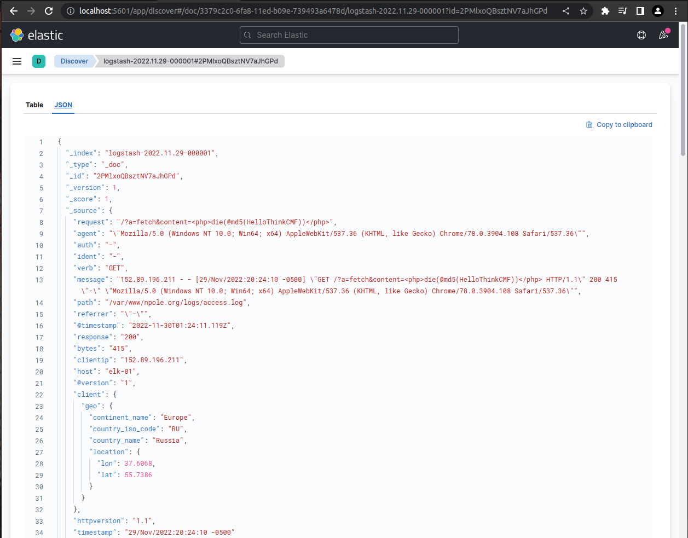

# Module 1: SIEM

  

    Table of contents
  

  {: .text-delta }
1. TOC
{:toc}

## Learning Objectives
- What is SIEM?
- What are the functional components of a SIEM platform?
- What can I do with SIEM?

## Overview: What is SIEM?
SIEM stands for security information and event management.

## Components of SIEM platform
A SIEM solution may cover all or only some of these components. Security concerns vary greatly from company to company, and some features are only used by government systems or where they are required by law.

### 1. Data Aggregation
This component of SIEM is responsible for gathering logs that are generated by devices within the corporate network, like application servers, network devices, and employee workstations.

There are three major log collection methods:
1. Agent-based log collection
2. Agentless log collection
3. API-based log collection

In agent-based log collection, an agent is installed to ingest logs from a file. This doesn't require whatever is generating the logs to support logging directly to you database; instead a seperate process watches for changes to the file and sends the data to your database in a secure manner.

Agentless log collection is possible where the application that is producing the logs supports integrating with your SIEM platform directly. Basically, the agents job is wrapped up into the existing application.

In API-based log collection, logs can be collected from network devices using an application programming interface (API) to collect the logs from the server using a process running on an entirely seperate server. This seperate server can then process the data it recieves through the API and send it through to your database.

### 2. Security Data Analytics
SIEM platforms make security data analytics possible with reports and dashboards. Security Engineers can monitor these dashboards of realtime security data to get an idea of the state of their network, and to identify potential problems as they occur. Many SIEM solutions also generate predefined reports, which assist the company in detecting threats and preparing for security audits.

### 3. Correlation and Security Event Monitoring
This component is on of the most powerful parts of SIEM. Predefined correlation rules allow companies to analyze log data for an relationship that exists between different network activity logs or common attributes. A simple example of a correlation rule is "If a user fails to login many times in a short persioud of time but is then able to log in succesfully, trigger an alert." These correlation rules can detect suspicous activity, a potential breach in the network, and system compromise.

Maintaining these rules is a neverending task as new vulnerabilites and attack vectors surface daily, so this is one of the beneifts of paying for a managed SIEM solution as opposed to developing one from scratch.

### 4. Forensic Analysis
Root cause analysis and incident reports are foundational job duties for Security Engineers. SIEM platforms make that mych easier buy allowing the user to "drill down" through logs of a breach or attack after the fact to determine exactly how the bad actor was able to gain access to the system.

This component of SIEM is often legally mandated.

### 5. Incident Detection and Response
A security incident is an attempted or successful data breach in the corporate network by an bad actor. SIEM platforms detect security incidents as they happen using event correlation, user and entity behaviour analytics (UEBA), and threat intelligence.

Once the incident has been identified, many SIEM platforms support not only triggering alerts but automated actions to neutralize the threat using predefined workflows.

This component of SIEM allows companies to lower their mean time to detect and resolve incidents.

### 6. Real-time Event Response or Alerting Console
SIEM platforms ingest network data in realtime and can instantly notify incident response teams when an incident is detected. 

### 7. Threat Intelligence
There are many public and private threat intelligence feeds that can be used to obtain the contextual information that is require to identify potential security issues in the corporate system before they are exploited.

SIEM platforms can aggregate these threat intelligence feeds and provide an environment where they can be compared to the current state of the network to identify potential security vulnerabilities.

### 8. User and Entity Behaviour Analytics (UEBA)
UEBA uses machine learning techniques to train a behaviour model that represents the normal operation of the corporate network. Once this baseline is set, alerts can be triggered when the network activity deviates too far from the normal behaviour model. These anomolies can then be investigated further, or dealt with using predefined automated rules.

UEBA differes from a correlation engine because it is not rule based. Instead it relies on behavioral analytics.

### 9. IT Compliance Management
Most companies are expected to meet certain regulations regarding data security. These regulations vary by industry and region, but normally there are fines associated with noncomplaince.

Many of the components that have been covered here are required by some regulations. Companies may also need to comply with security audits by third party entities. SIEM platforms allow companies to prepare for these audits and know that they will pass ahead of time.

## Real world example
SIEM solutions like Enigma Glass ingest all kinds of logs using small “agent” processes that run on devices. These agents can watch log files for changes, filter additions using software defined rules, and intelligently serve relevant data as json to a key-store index running somewhere else. The communication between the agents and the server can be TLS encrypted, which makes it possible to securely ingest logs from edge devices on entirely different networks.

Agents are highly configurable, and can be customized to support any application that logs to a file. For example, a web server running apache could be configured with an agent that watched the connection log. This connection log alone is enough data to create some really interesting visualizations.

The following screenshots were gathered using a boilerplate ELK / Apache install on an Ubuntu VPC that is being hosted by Linode.

### Apache Access Log
Below is the output of running `less /var/www/{my_domain}/logs/access.log`. Every web request that the apache server receives is logged here as text. Each message contains a timestamp that can be used to index the log event.

### Logging Agent Configuration
Logstash is Elastic's data processing pipeline. It is one of many solutions for loading data into the Elastic server. Below is the contents of `/etc/logstash/conf.d/apache.conf` which stores the filtering rules that inform the pipeline on how to format the data in the json it's sending to the Elastic server, and where to look for the logs. Note the `geoip-info` pipeline that is specified to run here. This has been defined on the Elastic server to take the ip address data from the log event and populate additional geo fields to add to the event json.

### Pipeline Configuration
The json in this pipeline definition is used to tell Elastic to use `client.ip` and `source.ip` fields to search for geo data using their cache databases that are populated by open source (cc by-sa 4.0 license) databases of geo data and ip address components. [Read more](https://www.elastic.co/guide/en/elasticsearch/reference/current/geoip-processor.html)

### Apache Log Event
This is a screenshot of the json content of a single apache log event in Kibana, which is Elastic's visualisation layer. This json is made up of fields that are either populated by data that comes directly from the log file, or by data that is the product of a defined data processing pipeline. This makes it possible to use client ip addresses to look for geo data, for example.

### Events in Aggregate
Below is a screenshot of Kibana's Discover page with the apache logstash index pattern selected. From this view the user can search through the events using Elastic's powerful querying language, or simply by clicking through events and adding filters through the user interface.

### Visualising Data
Data can be visualised in charts or graphs for aggregate analysis. Users can apply filters to the visualtions that change the scope of time and any other field in the event json.

### Dashboards
Data visualistaions can be collected in dashboards which allow users to see visualisations that can be made up of data from a variety of sources. Below is a screenshot of an example overview dashboard that a webmaster might user to monitor the perfomance of their apache server.

This dashboard contains a few interesting visualisations using geo data from the log events.

### Drilling Down
In this screenshot example, the user has "drilled down" on the client country visualisation by selecting the United States. This dashboard was created to display various geo data, but by drlling down through the webmaster dashboard a filter has been applied that only populates the visualisations with events from the United States.

## Searching for Malicious Requests
Searching for event logs for post requests originating from Russia yields some interesting results; most likely scrapers searching for vulnerabilities. Note the ugly post request in the message fields. At the time of the screenshot this site had been up less than 24 hours.

## Sources
- [SIEM Components](https://www.manageengine.com/log-management/siem/siem-components.html)
